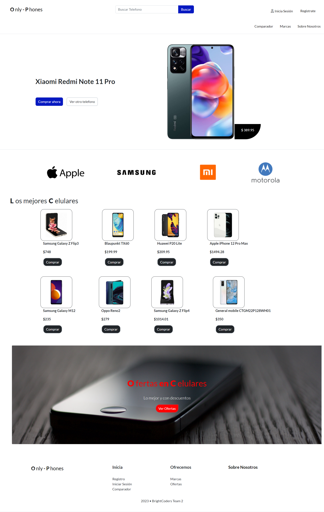

# 📱Only-Phones 👀

       

## 📃Descripción
<h3>
Es un e-commerce 🛒 (tienda en linea), en donde solo se venden telefonos, el cual te permite comprar y vender, al igual que hacer una comparacion de telefonos en cuanto a calidad, precio y caracteristicas.
</h3>

## 💻 Como ver la pagina web:
La pagina web se encuentra en el siguiente enlace:

### __https://onlyphones.onrender.com__

## 🎯 Actividades realizadas 

Dentro de este Proyecto las actividades que hicimos fueron las siguientes, para mas informacion pueden checar el [plan de trabajo](./instructions/instructions.md)

- Crear un modelo de baja fidelidad en el __UI__ para tener una base de diseño.
- Crear un diagrama de BD.
- Crear bases de datos en __PostgreSQL__.
- Crear varios __CRUD__ con formularios para las distintas funcionalidades.
- Dar estilos acorde al __UI__ planteado, con __SASS__ y __Bootstrap__.
- Aplicar las reglas de la comunidad de Ruby para hacer mas legible el codigo.
- Consumir una __API__ de uso publico para obtener la informacion de los telefonos.
- __Deployment__ del proyecto en Render.com.

## 🧑🏼‍🏭 Colaboradores:

- AangelF <aangel.flores.r@gmail.com>
- M-Cordova-M <alberto971801@gmail.com>
- AlanGonzalezM <alangonzalez119@gmail.com>

## ⚙️ Tecnologías usadas:
- Visual Studio Code
- Ruby on Rails 🛤️
- Git
- Github
- POO
- Rubocop
- Bootstrap
- SASS
- Consumo de APIS
- HTML </>
- JavaScript
- Postgresql 💾
